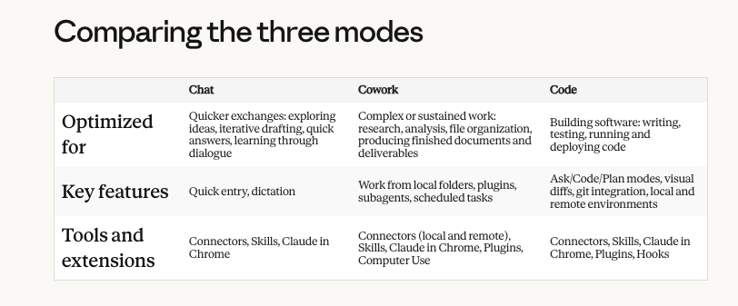
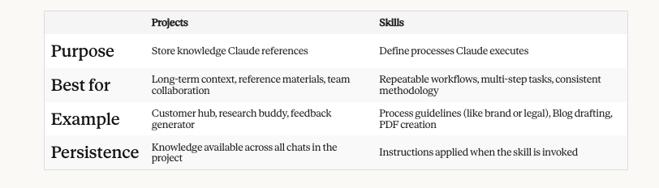

# **Writing a good prompt?**
1. Set Stage
2. Define Task
3. Specify Rules

# **Models**
- Opus: for most complex tasks
- Sonnet: for everyday tasks

# **Apps**
1. Chat
2. Cowork
    - Folder Access
    - Scheduled Tasks
    - Subagents
    - Dispatch
    - Projects
    - Browser Use
    - Computer Use
    - Plugins
    - Protected Environment
3. Code
    - Local
    - Remote

# **Artifacts**
Artifacts are standalone, interactive outputs that Claude creates in a dedicated window alongside your conversation. Instead of getting a long block of code or text buried in the chat, you see your content rendered and ready to use—whether that's a working website, an interactive chart, or a document you can immediately download.

Claude automatically creates an artifact when content meets certain criteria:

- It's significant and self-contained, typically over 15 lines
- It's something you're likely to want to edit, iterate on, or reuse
- It represents complex content that stands on its own without needing the surrounding conversation
- It's content you'll want to reference or use later

# **Skills**
Skills are folders of instructions, scripts, and resources that Claude loads dynamically to improve performance on specialized tasks. Think of them as expertise packages—they teach Claude how to complete specific tasks in a repeatable way.

Custom Skills can codify entire repeatable workflows — a quarterly variance analysis methodology, a brand voice review process, or a compliance checklist — so Claude follows the same rigorous steps every time.

## **Types of Skills**
- Anthropic Skills are created and maintained by Anthropic. These include enhanced document creation capabilities for Excel, Word, PowerPoint, and PDF files. Anthropic Skills are available to all paid users and Claude invokes them automatically when relevant—you don't need to do anything special to use them.
- Custom Skills are ones you or your organization create for specialized workflows and domain-specific tasks. For example, you might create a skill that applies your company's brand guidelines to presentations, structures meeting notes in a specific format, or executes your organization's data analysis workflows.

